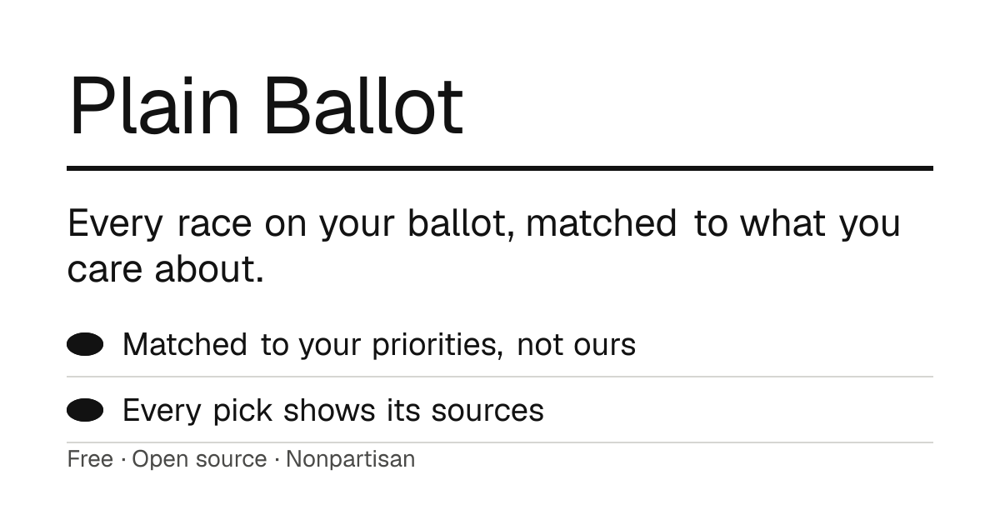

<div align="center">

# Plain Ballot

**Every race on your ballot, matched to what you care about. Every position backed by a quote you can check.**

[plainballot.com](https://plainballot.com) · [How it works](https://plainballot.com/methodology) · [The open data](https://github.com/n8peace/open-election-data) · [Contribute](CONTRIBUTING.md)

[](https://github.com/n8peace/plainballot/actions/workflows/ci.yml)
[](LICENSE)
[](https://github.com/n8peace/plainballot/stargazers)



</div>

Who's running, and where do they stand? Pick the issues you care about, set a dial for each, and enter your address. Plain Ballot goes through your ballot and shows who fits you, why, and where that came from. Party labels stay hidden until you ask. No ads, no account, nothing stored.

Covering every race in California, plus U.S. House and Senate in all 50 states, for Nov 3, 2026.

**Two projects, both free and open:**

- **[Plain Ballot](https://plainballot.com)** (this repo): the voter guide.
- **[Open Election Data](https://github.com/n8peace/open-election-data)**: the research behind it. Every candidate on the same 18 issues, each position with an exact quote and its source, researched by AI agents that have to agree. Free to use, including commercially, under the Open Database License, with a [free API](https://n8peace.github.io/open-election-data/).

## AI that has to show its work

Chatbots get voting facts wrong. Plain Ballot is built so no single model's word ever reaches a voter.

- **Agents have to agree.** Every candidate is researched by independent agents on different models (Claude Code, Codex, GPT-5.6 Luna), each searching and reading on its own. A position is published only when they agree: 2 of 3 with no conflict, or a clear majority of 10 when they don't.
- **Every quote is verified.** Each claim carries an exact quote, fetched from its source and matched word for word, or it's thrown out. A nightly job rechecks every published quote.
- **No guessing.** An agent not finding a source never counts as a vote. No majority means the issue stays blank, and the ballot says so.
- **Matching isn't AI.** It's plain, deterministic arithmetic in your browser ([lib/match.ts](lib/match.ts)). Same answers, same ballot, every time.
- **Voters can push back.** "Not right?" on any claim files a public issue and reruns the research with fresh agents. Corrections are public.
- **Every change is checked for bias.** Three models from different companies review each pull request for loaded wording and one-sided logic, and tests require that matching treats both ends of every dial the same.
- **Every word is public.** The dial wording, the agreement rules and every researched position live in [Open Election Data](https://github.com/n8peace/open-election-data); the matching lives here.

## Use the data

The research is its own project: **[Open Election Data](https://github.com/n8peace/open-election-data)**. It has a free, static API with no key needed:

```bash
curl -s https://n8peace.github.io/open-election-data/v1/divisions/ca/cd-10.json
```

Use it for anything, including commercial products, under the Open Database License: credit it, and share improvements to the data under the same terms.

## Why not just use Ballotpedia?

Ballotpedia is a great reference, and the research agents read it. But it can't be the whole answer:

- **It tells you who's running, not where they stand on your issues.** Its candidate survey is the closest thing, and many candidates never answer it. Plain Ballot needs every candidate placed on the same 18 dials so they can be compared.
- **Its data isn't open.** Bulk access is a paid product, and its pages aren't ours to republish. Everything here is free to copy, check and reuse.
- **Every claim needs the candidate's own words.** A summary of a position isn't enough; agents follow it back to the candidate's site, voting record or interview and quote that.

## Research your state

The research runs on your own Claude or ChatGPT plan, so anyone can add coverage without paying for API credits. It happens in [Open Election Data](https://github.com/n8peace/open-election-data), which has an open "research your state" issue for each state.

## Run it locally

```bash
npm install
cp .env.example .env.local
npm run dev                        # http://localhost:3000
```

Without keys, it runs on a fictional sample ballot and the dials still work. Researched races come from the open data's API (set `ELECTION_DATA_DIR` to a local checkout's `data/positions` to work offline). Keys turn on typed priorities (`AI_GATEWAY_API_KEY`), real ballot lookup (`GOOGLE_CIVIC_API_KEY`) and address suggestions (`GOOGLE_PLACES_API_KEY`).

```bash
npm test               # matching, neutrality, sharing, abuse limits
npm run eval           # does the AI put people on the right side of each dial? (calls the model)
npm run check:issues   # dial wording matches the research data
```

## How it's built

Next.js on Vercel. The Census geocoder finds a voter's districts. Researched races come from the Open Election Data API, matched to voters by district. BotID, rate limits and a spending cap protect the paid endpoints ([docs/security.md](docs/security.md)). The full picture, with a diagram: [docs/ARCHITECTURE.md](docs/ARCHITECTURE.md). Coding with an AI agent? Point it at [AGENTS.md](AGENTS.md).

## Contributing

The most useful help is research and checking research, and neither needs code. See [CONTRIBUTING.md](CONTRIBUTING.md), or open a ready-to-run copy in your browser:

[](https://codespaces.new/n8peace/plainballot)

## License

AGPL-3.0. Anyone can run their own copy, but a hosted copy has to publish its changes, so nobody can quietly run a biased version.

## Star history

[](https://star-history.com/#n8peace/plainballot&Date)
