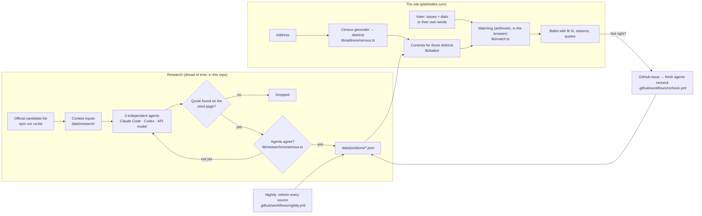

# How Plain Ballot is built

Two separate paths: **research** happens ahead of time and produces reviewable JSON files; **the site** reads those files and matches them to a voter in the browser. No AI runs between a voter's dials and their results.

## The pieces

| Piece | What it does | Code |
|---|---|---|
| Dials | 18 issues, each end worded the way its supporters would say it | [lib/issues.ts](../lib/issues.ts) |
| Own words | A small model reads a voter's sentence into dial settings. It names sides in words; code converts them to numbers. | [lib/ai/interpret.ts](../lib/ai/interpret.ts) |
| Districts | U.S. Census geocoder turns an address into district keys like `ca/cd-10` | [lib/address/census.ts](../lib/address/census.ts) |
| Ballot | Researched contests matched by district, in printed-ballot order. A sample ballot fills in when nothing's researched. | [lib/ballot/](../lib/ballot/) |
| Matching | Weighted distance between a voter's dial and each choice's position. Unknown positions are left out, never guessed. | [lib/match.ts](../lib/match.ts) |
| Research agents | Each agent searches and reads on its own and must return an exact quote for every position | [lib/research/agent.ts](../lib/research/agent.ts), [backends.ts](../lib/research/backends.ts) |
| Agreement | 3 agents; 2 more when only one found something; 10 and a majority on a real conflict. Not finding a source is never a vote. | [lib/research/consensus.ts](../lib/research/consensus.ts) |
| Quote check | Fetches the page and requires the quote to appear, normalized for spacing and punctuation | [lib/ai/research.ts](../lib/ai/research.ts) |
| Protection | Rate limits, bot checks, spend caps, size and time limits | [docs/security.md](security.md) |

## Checks on every change

| Check | Runs | Catches |
|---|---|---|
| Tests, types, lint | Every push and pull request ([ci.yml](../.github/workflows/ci.yml)) | Broken matching, and asymmetry: mirrored dials must give mirrored results ([tests/neutrality.test.ts](../tests/neutrality.test.ts)) |
| Quote verification | Every push and pull request | A claim whose quote isn't on its source page |
| Bias review | Every pull request ([bias-check.yml](../.github/workflows/bias-check.yml)) | Loaded wording, one-sided logic, selective research. Three models from different companies; blocks when two agree on a serious concern. |
| Quote drift | Nightly ([nightly.yml](../.github/workflows/nightly.yml)) | Sources that changed or disappeared after publishing |
